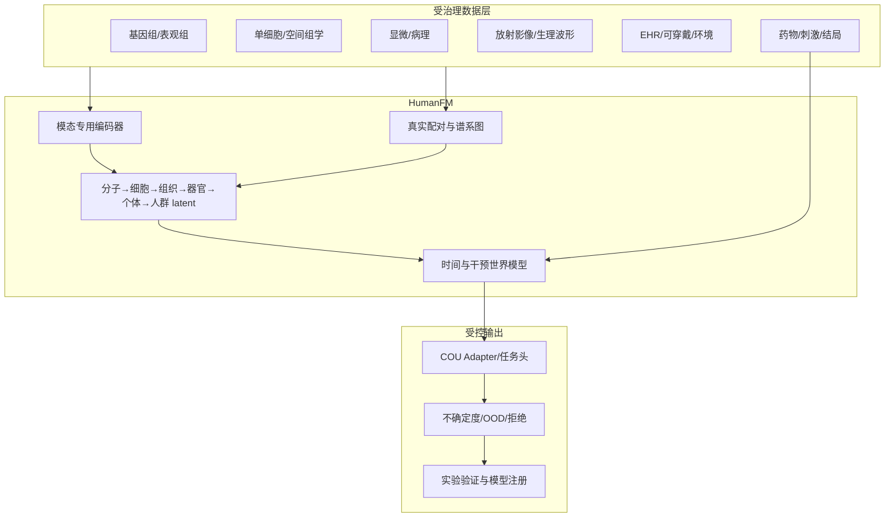

# 通用人体Foundation Model框架

## 定义与边界

本项目将“通用人体大模型”定义为一个跨尺度、跨模态、可复用的人体状态表征与干预响应预测平台：它连接分子、细胞、组织、器官、个体和人群数据，支持多个明确的研发Context of Use（COU）。它不是患者的完整数字复制品，也不是可以独立做诊断、处方或FDA注册决策的单一黑盒。

2024年的AI Virtual Cell研究愿景同样强调多尺度、多模态和对细胞状态及干预的模拟，而不是仅训练一个文本模型。[How to build the virtual cell with artificial intelligence](https://pubmed.ncbi.nlm.nih.gov/39672099/)

推荐的产品形态是：

```text
HumanFM = 专用模态编码器
        + 受治理的真实配对关系
        + 跨尺度状态空间
        + 时间/干预世界模型
        + COU专用Adapter和任务头
        + 校准/OOD/拒绝层
        + 冻结模型注册表
```

LLM和Agent只负责证据检索、工作流和决策说明，不能将生成文本当作人体生理数据。Agent只能调用模型注册表中与COU完全匹配的已发布版本。

## 系统架构



### 模态编码器

不同数据不能使用同一种tokenizer。建议分别维护基因组、单细胞、空间组学、显微影像、病理、放射影像、生理波形和临床事件编码器。原始数据由受控Adapter转换为token，HumanFM融合核心不直接解析DICOM、FASTQ或OME-Zarr。

单细胞部分应优先适配现有模型而不是从零训练。scGPT的预训练使用超过3300万个细胞，说明单细胞基础模型需要远大于当前内部数据的规模。[scGPT](https://www.nature.com/articles/s41592-024-02201-0) 显微影像可采用自监督继续预训练；Cell-DINO和SubCell说明自监督方法可以从显微影像获得可迁移的生物形态表征。[Cell-DINO](https://pmc.ncbi.nlm.nih.gov/articles/PMC12826486/)、[SubCell](https://pmc.ncbi.nlm.nih.gov/articles/PMC12636579/)

### 真实配对与谱系

跨模态对齐必须声明下列等级之一：同一次测量、同一标本、同一人在时间窗内、同一人但不同时间，或仅来自相似队列且不配对。只有“同一次测量”和“同一标本”默认可产生强对比学习正样本；同一人的时间窗或纵向记录只能作为带时间差、部位、来源和置信度的弱连接，用于时间模型或专门设计的加权损失。相似队列数据属于`population_unpaired`，不得构造个体正样本。

系统将每条对齐关系单独记录为`AlignmentEdge`，区分实验直接测得与推断连接。按疾病、年龄、人口学或embedding最近邻匹配得到的记录不能升级为“同一个体”或“同一标本”。

核心谱系应为：

```text
person → encounter → specimen → aliquot → derivative/organoid
                              → region → cell → molecule
person → intervention → timepoint → phenotype/outcome
```

来自GTEx的组织表达、来自其他队列的影像和来自第三个队列的EHR不能因为疾病名称相同就拼成一个“虚拟患者”。这些数据只能在群体或ontology层对齐。

### 跨尺度融合

每个尺度维护少量可学习latent token。模态token只进入其受控尺度，然后通过跨尺度Transformer传播信息。缺失模态使用显式missing token和mask，不用零填充冒充真实测量。

参考实现位于：

- `src/virtualhuman_agents/foundation/architecture.py`
- `src/virtualhuman_agents/foundation/schemas.py`
- `src/virtualhuman_agents/foundation/registry.py`

### 干预世界模型

世界模型估计：

```text
p(human_state[t+Δt] | human_state[t], intervention, dose/context, Δt)
```

输出均值和方差，而不是单一点预测。观察性EHR主要帮助学习状态和自然史，真正的干预效应必须依赖随机试验、受控离体实验、药物/刺激时间序列或经过明确因果设计的准实验数据。

## 数据工程标准

| 数据域 | 推荐标准 |
|---|---|
| 显微和高内涵影像 | OME-TIFF、OME-NGFF/OME-Zarr及完整仪器元数据 |
| 放射影像 | DICOM及受控series/study/患者伪名映射 |
| 单细胞/空间组学 | FASTQ作为源数据，矩阵使用H5AD/Zarr并保存pipeline版本 |
| 基因组 | FASTQ/CRAM/VCF、参考基因组和variant caller版本 |
| 临床数据 | FHIR用于交换；OMOP CDM用于研究分析 |
| ontology | CL、UBERON、GO、MONDO、HPO及固定发布版本 |
| 模型数据 | 不可变manifest、SHA-256、数据卡、同意查询结果和split快照 |

[OME-NGFF](https://ngff.openmicroscopy.org/index.html)提供云友好的显微数据规范；[FHIR R5](https://hl7.org/fhir/R5/)是医疗数据交换标准；[OMOP CDM 5.4](https://ohdsi.github.io/CommonDataModel/)用于标准化观察性健康数据；[Cell Ontology](https://obophenotype.github.io/cell-ontology/)和[HPO](https://obofoundry.org/ontology/hp)分别提供细胞类型和人体表型受控词汇。

## 训练课程

### 阶段0：数据准入

完成权属、同意、计算地域、直接标识符、文件校验、样本谱系、近重复、供体/亲缘簇、站点和时间切分检查。任何一项关键问题均不得开始训练。

### 阶段1：单模态自监督

分别训练或继续预训练各模态编码器。采用供体均衡采样，避免拥有大量图像、细胞或就诊记录的个体主导损失。必须同时运行传统特征、任务专用网络和简单线性模型作为基线。

### 阶段2：受治理的跨模态对齐

只对同一次测量或同一标本的真实配对数据使用强对比学习。同一个人的纵向记录需要显式时间模型或降权损失；仅同队列但无个体配对的数据可用于分布匹配、ontology监督或弱监督多实例学习，不能作为一一对应正样本。

### 阶段3：时间和干预学习

学习缺失时间点、状态轨迹、剂量—时间响应和恢复过程。训练目标包括时间预测、干预响应、负对照和不确定度。模型应输出没有支持证据时的拒绝，而不是强行外推。

### 阶段4：跨尺度状态学习

以同一标本、同一供体和有明确空间/时间关系的数据为锚点连接尺度。通过模态dropout验证缺失模态下的性能，并对错误配对进行红队测试。

### 阶段5：COU适配

冻结大部分backbone，只训练Adapter、任务头、校准和OOD组件。每个COU必须有独立数据、性能要求和错误后果。

### 阶段6：锁模前瞻验证

冻结权重、预处理、ontology、阈值、代码、容器和数据快照。在新供体、时间外数据和至少一个从未参与预训练的中心开展盲法验证。注册性配置禁止在线学习。

默认课程已编码在 `src/virtualhuman_agents/foundation/curriculum.py`。

## 数据划分与防泄漏

- 同一人的所有就诊、标本、衍生物、类器官、图像patch、组学和时间点必须在同一分区。
- 同一WSI和相邻重叠patch不得跨分区。
- 基因组任务按个体和亲缘簇切分。
- 药物任务除供体外还要进行化合物骨架、机制和干预留出。
- 用于预训练的个体不能再宣称为完全外部验证。
- 任何用于错误分析、阈值选择或模型选择的数据都属于开发数据。
- 归一化、特征选择、词表、批次校正和缺失值规则只能在开发数据拟合。
- 外部站点测试要求整个站点不参与训练、预训练或阈值设定。

`HumanDataRegistry`默认以最小独立分组和供体双重检查跨分区泄漏，并使外部站点重用成为关键错误。

## 评测体系

必须同时报告冻结编码器线性探针、1%/5%/10% few-shot、Adapter和全量微调结果，并与简单基线比较。

| 维度 | 评测内容 |
|---|---|
| 表征 | 细胞类型、组织状态、器官结构、疾病分型、跨模态检索 |
| 预测 | 表型、器官功能、药物响应、纵向结局 |
| 时间/干预 | 效应方向、响应排序、剂量—时间曲线、预测区间覆盖 |
| 外部泛化 | 站点、时间、设备、SOP、疾病、祖源、干预留出 |
| 校准 | Brier、ECE、校准斜率、保形覆盖率 |
| OOD | 风险—覆盖曲线、OOD误接受率、误拒率、拒绝后性能 |
| 公平性 | 年龄、性别、祖源、疾病亚型和站点及其置信区间 |
| 隐私 | 成员推断、模型反演、稀有变异提取和训练内容记忆 |
| 稳健性 | 缺失模态、错误配对、时间错位、批次偏移和数据污染 |

Attention、SHAP或embedding邻近关系只能用于提出机制假设，不能独立证明因果机制。

## 模型发布与Agent接口

一个可发布单元必须固定：模型权重、配置、tokenizer/预处理、训练数据快照、代码、容器、ontology、OOD检测器、阈值、COU、禁止用途和退役规则。

`FoundationModelRegistry`只有在数据审计和所有关键评测闸门通过后才允许发布。Agent解析模型时要求COU字符串完全匹配；开发模型不能被生产Agent调用。每次推理记录输入哈希、版本、OOD状态、不确定度、输出哈希和拒绝原因。OOD拒绝时禁止生成科学输出。

## 建设路线

| 时间 | 交付 | Go/No-Go |
|---|---|---|
| 0–3个月 | 数据目录、权属和同意策略、ontology、谱系、供体级切分、简单基线 | 关键数据权利或供体关联不清即停止 |
| 4–9个月 | 影像、单细胞和临床事件编码器适配；HumanFM-v0融合 | 至少三个下游任务超过最佳简单基线 |
| 10–15个月 | 真实配对跨模态对齐、时间与类器官干预世界模型 | 外部供体、干预留出和校准均合格 |
| 16–24个月 | 多器官扩展、独立中心验证、Agent模型注册桥 | 中心外/OOD/隐私/公平性关键闸门全通过 |
| 24–36个月 | 扩大到人群纵向数据和更多器官；限定COU发布 | 每个COU分别锁模和前瞻验证 |

完整“通用人体模型”是多机构、长期基础设施项目。首个可交付版本应限定为研究用途的跨尺度表征与干预假设生成，不能直接承诺全人体仿真。

## 运行参考实现

```bash
pip install -e '.[foundation,dev]'
virtualhuman-agent humanfm-demo
pytest
```

参考配置为 `configs/humanfm_v0.json`，数据清单模板为 `configs/dataset_manifest.example.json`。演示只执行合成张量前向传播，不构成生物学验证。

## 监管边界

FDA并不存在一个“人体大模型统一合格分数”。真正可能进入申报的是“固定权重＋固定预处理＋固定任务头和阈值＋明确COU”的版本。FDA的AI药物开发指南和2026年NAM验证框架目前均为草案，并强调COU、风险和适用性验证。[FDA AI药物开发草案](https://www.fda.gov/regulatory-information/search-fda-guidance-documents/considerations-use-artificial-intelligence-support-regulatory-decision-making-drug-and-biological)、[FDA 2026 NAM草案](https://www.fda.gov/regulatory-information/search-fda-guidance-documents/general-considerations-use-new-approach-methodologies-drug-development)
